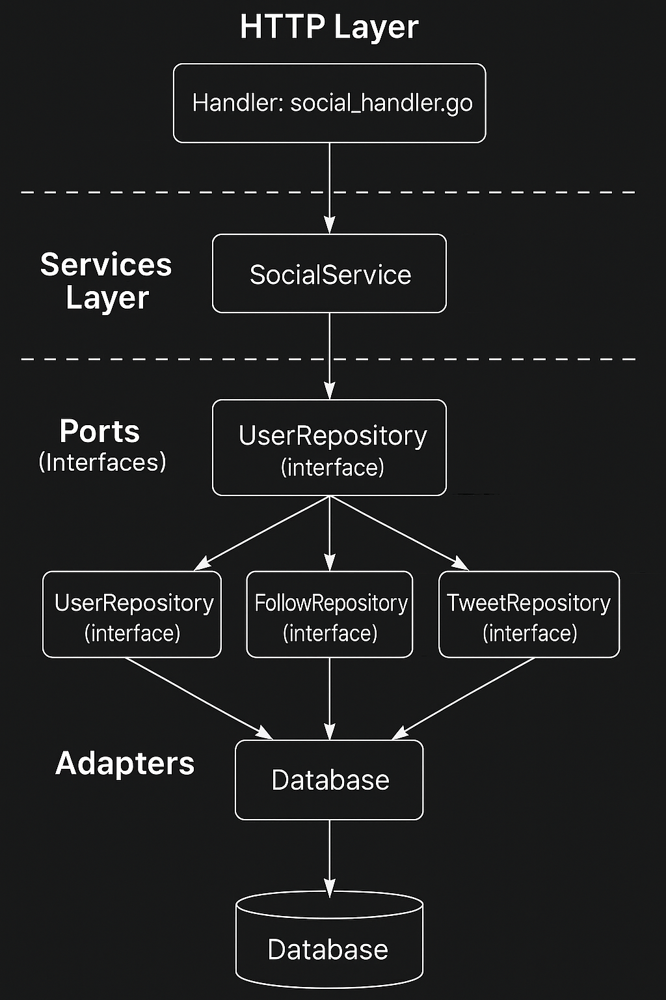

# social-network

Una red social simplificada construida con Go. Permite a los usuarios publicar tweets, seguir a otros y visualizar una línea de tiempo personalizada.

## 🚀 Tecnologías

- **Go**: Backend principal.
- **GORM + PostgreSQL**: Persistencia de datos.
- **Testify**: Tests unitarios.
- **Arquitectura limpia (Clean Architecture)**: Separación por capas y responsabilidades.

---

## 🧱 Arquitectura

La estructura está organizada en capas siguiendo los principios de Clean Architecture:


```
social-network/
├── cmd/api                  # main.go, router y wiring de dependencias
├── config                   # Archivos .properties para cada entorno (local, render)
├── docs/images              # Diagramas y documentación
├── internal/
│   ├── adapters/
│   │   ├── database         # Repositorios concretos, conexión y modelos persistentes
│   │   └── http             # Handlers HTTP (entrada de requests)
│   ├── dto                  # Requests únicamente
│   │                        # Respuestas:
│   │                        # - Mensajes simples en follow / crear tweet
│   │                        # - Listas de modelos (ej. tweets) en timeline
│   ├── errors               # Errores personalizados
│   ├── ports                # Interfaces para servicios y repositorios
│   └── services             # Lógica de negocio (casos de uso)
├── scripts/
│   └── init.sql             # Script SQL para inicializar la base de datos
```

### 🖼️ Diagrama de arquitectura



## 🔐 Variables de entorno

Para ejecutar la aplicación, es necesario definir la variable:

| Variable  | Descripción                                 | Valor sugerido |
|-----------|---------------------------------------------|----------------|
| `SCOPE`   | Define el entorno de ejecución  | `local`        |

> ✅ Al establecer `SCOPE=local`, la aplicación toma automáticamente la configuración de conexión desde el archivo `config/local.properties`, donde ya están definidos el host, puerto, usuario, password y base de datos local.


## 📬 Endpoints (con ejemplos `curl`)

### 🧷 Seguir a un usuario

**POST /follow**

Permite que un usuario siga a otro.

```bash
curl --location 'https://social-network-1gua.onrender.com/follow' \
--header 'Content-Type: application/json' \
--data '{
  "follower_id": "1111",
  "following_id": "2222"
}'
```

---

### 📝 Crear Tweet

**POST /tweets**

Crea un nuevo tweet.

```bash
curl --location 'https://social-network-1gua.onrender.com/tweets' \
--header 'Content-Type: application/json' \
--data '{
  "user_id": "1111",
  "content": "¡Hola, mundo desde curl!"
}'
```

---

### 📜 Obtener Timeline

**GET /timeline**

Devuelve los tweets del usuario y de las personas que sigue.

```bash
curl --location 'https://social-network-1gua.onrender.com/timeline' \
--header 'X-User-ID: 1111'
```

---
## 🧪 Tests

Este proyecto incluye tests unitarios utilizando Testify.

```bash
go test ./... -v